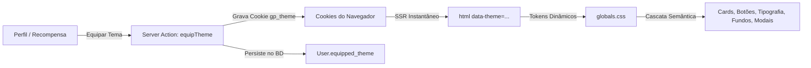

# 🎮 Catálogo & Especificação Arquitetural dos Temas — Gamers Aposentados

> **Documento de Referência:** Este arquivo detalha minuciosamente os 5 temas visuais da plataforma, suas características técnicas, lore, variáveis CSS, tipografia, física de partículas, síntese de áudio procedural e diretrizes de design. Serve como a **base oficial** para aprofundarmos a diferenciação entre eles.

---

## 🏗️ 1. Arquitetura do Sistema de Temas

O sistema de temas da plataforma funciona de ponta a ponta sem recarregar a página, combinando CSS Custom Properties com persistência síncrona:

- **Injeção SSR (`src/app/layout.tsx`)**: O atributo `data-theme` é aplicado na tag `<html>` diretamente na renderização do servidor através do cookie `gp_theme` (fallback para `"cyberpunk"`), eliminando qualquer efeito de flash branco/incompatibilidade (FOUC).
- **Provedor Reativo (`src/components/providers/theme-provider.tsx`)**: Permite a troca instantânea no cliente e sincroniza com a sessão do usuário.
- **Tokens HSL & Hex (`src/app/globals.css`)**: Cada tema sobrescreve tanto as variáveis de cor utilitárias do Tailwind (`--primary`, `--background`, `--card`, `--border`) quanto os tokens de alta fidelidade (`--theme-primary`, `--theme-glow`, `--theme-card-bg`, etc.).

---

## 🎨 2. Especificação Detalhada por Tema

---

### 👾 Tema 1: Cyber Neon (Padrão da Plataforma)
*A fusão de alta tecnologia, ciberespaço, estética synthwave e holografia urbana.*

- **Identificador Técnico (`data-theme`)**: `cyberpunk` (e `:root`)
- **Inspirações & Referências**: *Cyberpunk 2077*, *Tron: Legacy*, *Blade Runner 2049*, *Ghost in the Shell*.
- **Lore / Citação**: *"Acorda, Samurai! Temos uma cidade pra queimar."*
- **Disponibilidade**: Nível 1 (Padrão inicial desbloqueado para todos os membros).
- **Raridade**: `COMMON`.

#### 🎨 Paleta & Tokens de Cor
| Token | Valor CSS / Hex / HSL | Finalidade |
| :--- | :--- | :--- |
| `--theme-primary` | `#bd0df2` (Neon Purple / Cyber Magenta) | Destaque principal, anéis de foco, bordas ativas |
| `--theme-secondary` | `#06b6d4` (Cyan Neon) | Acentos secundários, linhas de contraste lateral |
| `--theme-bg` | `#09090b` (Deep Void Zinc) | Fundo base da página |
| `--theme-card-bg` | `rgba(28, 10, 42, 0.96)` → `rgba(8, 6, 18, 0.96)` | Gradiente denso dos cards |
| `--theme-border` | `rgba(189, 13, 242, 0.35)` | Linhas de divisão e contornos |
| `--theme-glow` | `rgba(189, 13, 242, 0.5)` | Iluminação neon e sombras projetadas |
| `--radius` | `0.5rem` (8px) | Arredondamento padrão |

#### 🔤 Tipografia & Estilo de Texto
- **Headings (`h1` a `h6`, `.font-heading`)**: `'Audiowide', sans-serif !important`
  - *Tracking / Espaçamento*: `0.08em`
  - *Text-Shadow*: `0 0 12px rgba(189, 13, 242, 0.5)` (brilho difuso magenta)
- **Textos Correntes & Parágrafos**: Família do sistema / Geist Sans padrão para máxima fluidez de leitura.

#### 🖱️ Cursores Cibernéticos SVG (Nativo via Data-URI)
- **Cursor Padrão (`auto`)**: Lâmina ciber-angular estilizada de 32x32px com contorno preto de alto contraste (`2.5px`), borda em ciano neon (`#06b6d4`), núcleo escuro, iluminação holográfica ciano e núcleo interno magenta (`#bd0df2`).
- **Cursor Interativo (`pointer`)**: Retículo holográfico de mira cibernética ampliado de 32x32px com retículo segmentado magenta (`#bd0df2`), anel interno ciano, eixos de mira de alta precisão e ponto focal luminoso branco no centro (`16 16`) em links, botões e controles.

#### 📐 Geometria, Molduras & Botões
- **Superfície `.glass-card`**: Borda neon de 1px com guia ciano de 5px à esquerda (`border-left: 5px solid #06b6d4`), visor holográfico e efeito `:hover` com aumento de iluminação tridimensional.
- **Botões**: Recorte diagonal angular nos cantos opostos via `clip-path: polygon(0 0, calc(100% - 8px) 0, 100% 8px, 100% 100%, 8px 100%, 0 calc(100% - 8px))`, com aberração cromática RGB (`-1px 0 #06b6d4, 1px 0 #bd0df2`) ao hover e compressão no clique.
- **Scrollbar**: Trilho escuro com thumb em gradiente vertical magenta/ciano e glow neon reativo.
- **Barra de Progresso Cyberdeck (`ThemedProgressBar`)**: Chassi escuro com recortes angulares em 45°, preenchimento tri-color (`#7928ca` → `#bd0df2` → `#06b6d4`) com feixe laser iluminado (`#22d3ee`) na ponta ativa e marcadores verticais de calibração nos contratos.

#### 🌌 Atmosfera de Fundo (`body::before` & `body::after`)
- **`body::before`**: Matriz cibernética composta por gradientes radiais roxos e cianos nos cantos opostos e malha de grade linear de `32px x 32px`.
- **`body::after`**: Scanlines holográficas horizontais contínuas (`100% 4px`) simulando a interface de um visor óptico Kiroshi (`pointer-events: none`).

#### 🎆 Física de Partículas de Level Up (`LevelUpParticles.tsx`)
- Formato: Diamantes e estilhaços geométricos com rotação contínua.
- Paleta de partículas: `#bd0df2`, `#06b6d4`, `#f43f5e`, `#d946ef`, `#38bdf8`, `#ffffff`.
- Dinâmica: Dispersão explosiva em 360° desacelerada por atrito de plasma (`vx *= 0.98; vy *= 0.98`).

#### 🔊 Design Sonoro Web Audio API (`LevelUpAudio.ts`)
- Sintetizador: Onda Sawtooth com filtro passa-banda (*bandpass*, Q=3.0) e varredura de harmônicos ciber-espaciais rápida em arpeggio ascendente (`C4, E4, G4, C5, E5, G5, C6`).

---

### ⚔️ Tema 2: Taverna Medieval (RPG Clássico)
*O aconchego da lareira, a rusticidade do carvalho nobre, runas douradas e o calor da aventura clássica.*

- **Identificador Técnico (`data-theme`)**: `theme-medieval`
- **Inspirações & Referências**: *The Witcher 3: Wild Hunt*, *The Elder Scrolls V: Skyrim*, *Baldur's Gate 3*, *Dungeons & Dragons*.
- **Lore / Citação**: *"Dê uma moeda para o seu Bruxo, ó Vale da Abundância."*
- **Disponibilidade**: Desbloqueado ao atingir o **Nível 9**.
- **Raridade**: `RARE`.

#### 🎨 Paleta & Tokens de Cor
| Token | Valor CSS / Hex / HSL | Finalidade |
| :--- | :--- | :--- |
| `--theme-primary` | `#f59e0b` (Ouro Envelhecido / Âmbar Forjado) | Acentos dourados, ícones, foco |
| `--theme-secondary` | `#dc2626` (Rubi Real / Sangue de Dragão) | Botões de alerta, insignias nobres |
| `--theme-bg` | `#0d0a07` (Madeira Queimada Profunda) | Fundo acolhedor e escuro |
| `--theme-card-bg` | `linear-gradient(145deg, rgba(32, 23, 14, 0.96), rgba(16, 12, 8, 0.96))` | Tom de couro tratado e pergaminho |
| `--theme-border` | `rgba(245, 158, 11, 0.6)` / `#d97706` | Molduras de bronze e ouro |
| `--theme-glow` | `rgba(245, 158, 11, 0.6)` | Calor de tochas e lareiras |
| `--theme-title-accent`| `#fbbf24` | Títulos com brilho de tesouro |
| `--radius` | `0.375rem` (6px) | Cantos orgânicos moderados |

#### 🔤 Tipografia & Estilo de Texto
- **Headings (`h1` a `h6`, `.font-heading`)**: `'MedievalSharp', 'Cinzel', ui-serif, Georgia, serif !important`
  - *Tracking / Espaçamento*: `0.06em`
  - *Cor*: `#fbbf24` com `text-shadow: 0 0 15px rgba(245, 158, 11, 0.6)`
- **Corpo, Botões, Parágrafos e Spans**: `'Cinzel', ui-serif, Georgia, serif` (todos os textos adquirem aspecto de runa esculpida e alta fantasia).

#### 🖱️ Cursores de Fantasia RPG SVG (Nativo via Data-URI)
- **Cursor Padrão (`auto`)**: Adaga de aço élfico forjado ampliada para 32x32px com contorno preto de alto contraste (`3px`), gume prateado polido (`#ffffff` / `#94a3b8`), canaleta rúnica dourada (`#fbbf24`), guarda em bronze envelhecido (`#d97706`), cabo em tiras de couro (`#78350f`) e pomo cravejado com rubi lapidado (`#dc2626`).
- **Cursor Interativo (`pointer`)**: Tocha de aventureiro de 32x32px com chamas vivas em camadas (laranja, âmbar e núcleo incandescente branco `#ffffff`), contorno de alto contraste e bocal de ferro forjado sobre haste de carvalho escuro. O ponto de clique fica exatamente na ponta da labareda (`16 2`).

#### 📐 Geometria, Molduras, Botões & Frasco Alquímico
- **Superfície `.glass-card`**: Borda dupla ornamental (2px sólido `#d97706` com filete interno de pergaminho antigo de 1px), couro curtido e halo de aconchego de fogueira.
- **Botões**: Sinete de bronze e carvalho forjado com brilho superior de 1px e luz ambarina no hover.
- **Barra de Progresso Frasco Alquímico (`ThemedProgressBar`)**:
  - Silhueta cilíndrica de ampola/tubo alquímico arredondado (`rounded-full`).
  - Reflexo de vidro cristalino no topo (`::after`).
  - Preenchimento em hidromel dourado efervescente com animação contínua de microbolhas ascendentes (`@keyframes meadBubbles`).
  - Menisco de líquido curvo na extremidade com brilho de brasa dourada.
  - Graduações de volume alquímico entalhadas nos marcos de 25%, 50% e 75%.
  - Selo de cera / medalhão de bronze no badge numérico de porcentagem.

#### 🌌 Atmosfera de Fundo (`body::before`)
- Animação `emberPulse` (6s infinito alternado): Três gradientes radiais pulsantes simulando o calor de uma lareira acesa no rodapé da página.

#### 🎆 Física de Partículas de Level Up (`LevelUpParticles.tsx`)
- Formato: Círculos e diamantes de brasa viva.
- Paleta: `#f59e0b`, `#dc2626`, `#d97706`, `#fbbf24`, `#ef4444`, `#fef08a`.
- Dinâmica: Brasas que brotam na parte inferior da tela e sobem ondulando suavemente no ar com física senoidal (`vx + Math.sin(p.y * 0.02) * 0.8`).

#### 🔊 Design Sonoro Web Audio API (`LevelUpAudio.ts`)
- Sintetizador: Dupla de osciladores combinados (Triângulo simulando metais reais de fanfarra + Senoidal em oitava dobrada para ressonância de sino de castelo) tocando a fanfarra imperial triunfante (`G3, C4, E4, G4, C5`).

---

### 🚀 Tema 3: Odisseia Estelar (Sci-Fi & Fronteira Espacial)
*A imensidão do cosmos, instrumental de telemetria orbital, computadores de bordo e propulsão de dobra espacial.*

- **Identificador Técnico (`data-theme`)**: `theme-space`
- **Inspirações & Referências**: *Starfield*, *No Man's Sky*, *Mass Effect*, *Interstellar*, *Elite Dangerous*.
- **Lore / Citação**: *"Ao infinito e além das estrelas da Orla Exterior."*
- **Disponibilidade**: Desbloqueado ao atingir o **Nível 15**.
- **Raridade**: `EPIC`.

#### 🎨 Paleta & Tokens de Cor
| Token | Valor CSS / Hex / HSL | Finalidade |
| :--- | :--- | :--- |
| `--theme-primary` | `#38bdf8` (Azul Propulsão / Ciano Estelar) | Indicadores HUD, vetores, botões |
| `--theme-secondary` | `#fbbf24` (Amarelo Alerta Espacial / Ouro Cósmico) | Avisos de instrumentação, status |
| `--theme-bg` | `#010410` (Vácuo Cósmico Profundo) | Preto azulado ultra denso |
| `--theme-card-bg` | `linear-gradient(135deg, rgba(6, 22, 54, 0.96), rgba(2, 9, 28, 0.96))` | Painel de controle de nave espacial |
| `--theme-border` | `rgba(56, 189, 248, 0.7)` | Molduras de instrumentos |
| `--theme-glow` | `rgba(56, 189, 248, 0.75)` | Brilho holográfico de satélite |
| `--radius` | `0.25rem` (4px) | Cantos técnicos compactos |

#### 🔤 Tipografia & Estilo de Texto
- **Headings (`h1` a `h6`, `.font-heading`)**: `'Orbitron', 'Rajdhani', monospace !important`
  - *Tracking / Espaçamento*: `0.16em` (espaçamento ampliado de radar militar)
  - *Caixa Alta*: `text-transform: uppercase !important`
  - *Text-Shadow*: `0 0 15px rgba(56, 189, 248, 0.7)`
- **Corpo, Botões, Parágrafos e Spans**: `'Rajdhani', ui-monospace, monospace` com tracking técnico de `0.05em`.

#### 🖱️ Cursores Aeroespaciais SVG (Nativo via Data-URI)
- **Cursor Padrão (`auto`)**: Vetor delta de interceptor estelar de 32x32px com contorno preto reforçado de 3px, asa em compósito de carbono espacial `#030d22`, gume e bordas em ciano estelar `#38bdf8`, linha de telemetria central em amarelo alerta `#fbbf24` e farol de fóton branco no hotspot de clique `(3, 3)`.
- **Cursor Interativo (`pointer`)**: Retículo tático de travamento de alvo (Target Lock) de 32x32px com 4 cantoneiras HUD de cockpit em `#38bdf8`, anel orbital interno em `#fbbf24`, retículo em cruz e ponto de trava estelar central no hotspot `(16, 16)`.

#### 📐 Geometria, Molduras, Botões & Células de Propulsão
- **Superfície `.glass-card`**: Painel de cockpit em gradiente azul profundo pressurizado (`linear-gradient(135deg, rgba(4, 18, 48, 0.97), rgba(1, 8, 24, 0.98))`), borda ciano de 1.5px com guia tática lateral de 5px em `#0284c7` e halo de propulsão ionizada. Efeito hover reativo com iluminação expandida (`#7dd3fc`).
- **Botões**: Painel tático em caixa alta com tipografia `Rajdhani`, `letter-spacing: 0.12em`, fundo de instrumentação aeroespacial e brilho tátil no clique.
- **Barra de Progresso em Células de Dobra Segmentada (`ThemedProgressBar`)**:
  - Chassi de matriz de telemetria estelar em vácuo escuro com borda técnica `#0284c7` e guia esquerda ciano `#38bdf8`.
  - Preenchimento em **células de LED de plasma iônico discretas** via padrão repetitivo (`repeating-linear-gradient` com micropainéis de 8px e vãos escuros de 2px), simulando células de combustível de dobra em tempo real.
  - Ponta com feixe de fótons ultraluminoso branco `#ffffff` e halo coronal duplo em ciano e ouro cósmico.
  - Agulhas de calibração métricas nos marcos de 25%, 50% e 75% em amarelo alerta espacial (`#fbbf24`).
  - Badge de porcentagem em display digital de cockpit com borda ciano e fonte monospace.

#### 🌌 Atmosfera de Fundo (`body::before` & `body::after`)
- **`body::before`**: Animação `spaceTwinkle` (8s infinito) com grade técnica de radar de 40px combinada com nebulosas azuis e douradas pulsantes.
- **`body::after`**: Camada global de HUD orbital com vinheta tática de cabine e linhas de escaneamento translúcidas (`100% 6px`, opacidade 0.45, `pointer-events: none`).

#### 🎆 Física de Partículas de Level Up (`LevelUpParticles.tsx`)
- Formato: Traços lineares (*streaks*) simulando estrelas em velocidade de dobra espacial (Warp Speed).
- Paleta: `#38bdf8`, `#fbbf24`, `#818cf8`, `#c084fc`, `#e0f2fe`, `#ffffff`.
- Dinâmica: Aceleração centrífuga a partir do ponto central (`vx *= 1.01; vy *= 1.01`) sem gravidade.

#### 🔊 Design Sonoro Web Audio API (`LevelUpAudio.ts`)
- Sintetizador: Ondas senoidais límpidas em intervalos de quinta cósmica (`E4, B4, E5, B5, E6`) com efeito *glissando* de subida de frequência exponencial (`freq * 1.05`) simulando o salto para o hiperespaço.

---

### 🕹️ Tema 4: Arcade Retrô (16-Bit / Pixel Nostalgia)
*A glória dos cartuchos dos anos 90, tubos CRT, monitores de fósforo verde e tipografia arcade autêntica.*

- **Identificador Técnico (`data-theme`)**: `theme-pixel`
- **Inspirações & Referências**: *Chrono Trigger*, *Super Mario World*, *Street Fighter II*, *Mega Man X*, fliperamas clássicos.
- **Lore / Citação**: *"Pressione Start para reviver a era de ouro dos 16-bits."*
- **Disponibilidade**: Desbloqueado ao atingir o **Nível 22**.
- **Raridade**: `LEGENDARY`.

#### 🎨 Paleta & Tokens de Cor
| Token | Valor CSS / Hex / HSL | Finalidade |
| :--- | :--- | :--- |
| `--theme-primary` | `#22c55e` (Verde Fósforo CRT / Game Boy DMG) | Destaque arcade retrô, vida |
| `--theme-secondary` | `#f59e0b` (Amarelo Moeda de Fliperama) | Bordas de caixa de diálogo, botões |
| `--theme-bg` | `#050716` (Gabinete Arcade Noturno) | Preto azulado profundo |
| `--theme-card-bg` | `linear-gradient(145deg, rgba(8, 22, 60, 0.98), rgba(3, 10, 32, 0.98))` | Azul royal escuro característico dos JRPGs |
| `--theme-border` | `#f59e0b` com contornos internos `#22c55e` | Estilo moldura clássica de menu de batalha |
| `--theme-glow` | `rgba(34, 197, 94, 0.65)` | Emissão de tubo de raios catódicos |
| `--radius` | `0px !important` (Absolutamente zero cantos arredondados) | Geometria estrita em pixels |

#### 🔤 Tipografia & Estilo de Texto
- **Headings & Badges (`h1` a `h6`, `.font-pixel`)**: `'Press Start 2P', monospace !important`
  - *Line-height*: `1.4 !important`
  - *Text-Shadow*: `3px 3px 0px #000, 0 0 14px rgba(34, 197, 94, 0.7)` (sombra dura em bloco + glow)
  - *Escala Dinâmica*: Ajustada com `clamp()` para impedir quebra de layout no mobile e desktop.
- **Textos Longos, Avaliações, Inputs e Textareas**: `'VT323', monospace !important`
  - *Font-size*: `1.25rem` (tamanho balanceado para manter legibilidade total em 80 colunas).
  - *Word-Break*: `break-word`.

#### 🖱️ Cursores Pixel-Art SVG (Nativo via Data-URI)
- **Cursor Padrão (`auto`)**: Seta clássica de pixel-art 8-bit / 16-bit de 32x32px com contorno preto espesso em degraus de pixel exatos, preenchimento branco brilhante `#ffffff`, acento central em verde fósforo CRT `#22c55e` e hotspot preciso na ponta superior esquerda `(2, 2)`.
- **Cursor Interativo (`pointer`)**: Luva clássica de aventura pixelada 8-bit com dedo indicador apontando, contorno preto de alto contraste e clique no topo do dedo `(12, 2)`.

#### 📐 Geometria, Molduras, Botões & Blocos de HP 16-Bit
- **Superfície `.glass-card`**: Caixa de diálogo clássica de JRPG em azul royal (`linear-gradient(145deg, rgba(8, 22, 60, 0.98), rgba(3, 10, 32, 0.98))`), borda sólida amarela de 4px, moldura interna verde de 2px, sombra projetada dura de 5px em bloco (`5px 5px 0px #000, -3px -3px 0px #06b6d4`) e `border-radius: 0px !important` absoluto.
- **Botões**: Botões de fliperama mecânico com borda de 3px verde `#22c55e`, fundo escuro `#051a0e`, sombra dura `4px 4px 0px #000`, e afundamento mecânico tátil no clique (`translate(2px, 2px)` e sombra reduzida para `1px 1px 0px #000`).
- **Barra de Progresso em Blocos de HP 16-Bit (`ThemedProgressBar`)**:
  - Chassi com borda preta de 3px, contorno externo em amarelo moeda de 2px e cantos estritamente retos (`border-radius: 0px`).
  - Preenchimento em **blocos de HP retangulares discretos de pixel** (blocos de 10px com separadores pretos de 3px via `repeating-linear-gradient`), com chanfro tridimensional 16-bit (`#86efac` → `#22c55e` → `#15803d`).
  - Divisores de checkpoint nos marcos de 25%, 50% e 75% em amarelo fliperama (`#f59e0b`).
  - Placar numérico de pontuação arcade com fonte `'Press Start 2P'`, borda verde e sombra preta.

#### 🌌 Atmosfera de Fundo (`body::before` & `body::after`)
- **`body::before`**: Vinheta circular escura que recria a curvatura da lente de um tubo de TV antigo.
- **`body::after`**: Scanlines horizontais autênticas de monitor CRT (`background-size: 100% 4px; opacity: 0.28; pointer-events: none`).

#### 🎆 Física de Partículas de Level Up (`LevelUpParticles.tsx`)
- Formato: Cubos e pixels quadrados puros (`shape: "square"`).
- Paleta: `#22c55e`, `#f59e0b`, `#06b6d4`, `#ec4899`, `#a855f7`, `#ffffff`.
- Dinâmica: Gravidade arcade vigorosa (`vy += 0.18`) com rotações travadas em passos exatos de 90 graus (`(Math.floor(Math.random() * 4) * Math.PI) / 2`).

#### 🔊 Design Sonoro Web Audio API (`LevelUpAudio.ts`)
- Sintetizador: Onda quadrada (*square wave*) pura com modulação linear e saltos secos de 8-bit em arpeggio acelerado (`C4, E4, G4, C5, E5, G5, C6, E6`).

---

### 🩸 Tema 5: Noite de Yharnam & Sangue Carmesim (Bloodborne / Horror Vitoriano)
*O aço cirúrgico frio da noite, a Lua de Sangue pálida no horizonte, o ébano vitoriano e o sangue ancestral arterial.*

- **Identificador Técnico (`data-theme`)**: `theme-ascendant` (e `theme-darksouls`)
- **Inspirações & Referências**: *Bloodborne*, *Castlevania: Symphony of the Night*, horror gótico vitoriano e pesadelo cósmico.
- **Lore / Citação**: *"Nós nascemos do sangue, nos tornamos homens pelo sangue, somos destruídos pelo sangue. Tema o Sangue Antigo."*
- **Disponibilidade**: Desbloqueado no nível máximo da jornada (**Nível 25**).
- **Raridade**: `LEGENDARY`.

#### 🎨 Paleta & Tokens de Cor
| Token | Valor CSS / Hex / HSL | Finalidade |
| :--- | :--- | :--- |
| `--theme-primary` | `#e11d48` (Carmesim Sangue Arterial / Rubi) | Sangue principal, foco, borda superior |
| `--theme-secondary` | `#9f1239` (Bordô Sangue Antigo Escuro) | Sulcos de sangue, títulos auxiliares |
| `--theme-bg` | `#040206` (Noite Vitoriana Abissal) | Ébano e asfalto noturno molhado |
| `--theme-card-bg` | `linear-gradient(180deg, rgba(16, 6, 12, 0.98), rgba(6, 2, 6, 0.99))` | Ferro trabalhado vitoriano e ardósia negra |
| `--theme-border` | `rgba(225, 29, 72, 0.35)` | Molduras de ferro com halo de sangue |
| `--theme-glow` | `rgba(225, 29, 72, 0.65)` | Radiação carmesim lunar |
| `--theme-title-accent`| `#fda4af` | Prata rosada pálida da Lua de Sangue |
| `--radius` | `0.25rem` (4px) | Cantos afiados de arquitetura vitoriana |

#### 🔤 Tipografia & Estilo de Texto
- **Headings (`h1` a `h6`, `.font-heading`)**: `'Cinzel', Georgia, serif !important`
  - *Tracking / Espaçamento*: `0.14em`
  - *Caixa Alta*: `text-transform: uppercase !important`
  - *Cor*: `#f8fafc` (prata lunar pálida / branco ósseo de alto contraste)
  - *Text-Shadow*: `2px 2px 4px #000, 0 0 20px rgba(225, 29, 72, 0.7)` (sombra profunda com halo carmesim)
- **Textos Correntes & Parágrafos**: `var(--font-sans)` em tom prata gélida (`#e2e8f0`) para total acessibilidade e contraste 100% WCAG AAA.

#### 🖱️ Cursores Góticos SVG (Nativo via Data-URI)
- **Cursor Padrão (`auto`)**: **Saw Cleaver / Navalha Dentada do Caçador** de 32x32px com contorno preto reforçado de 3px, lâmina pesada em metal cirúrgico prateado frio (`#e2e8f0` / `#94a3b8`), sulcos em relevo vertendo sangue carmesim arterial (`#e11d48`), ataduras de linho envelhecido no cabo, pomo de sangue escuro e centelha de luz na ponta `(3, 3)`.
- **Cursor Interativo (`pointer`)**: **Runa de Sangue de Caryll / Olho da Percepção** de 32x32px com contorno preto grosso de 3px, símbolo arcano de caçador em carmesim puro (`#e11d48`), núcleo central com olho de percepção (*Insight*) e pupila branca brilhante, e clique com hotspot no ápice superior `(16, 2)`.

#### 📐 Geometria, Molduras, Botões & Transfusão de Sangue
- **Superfície `.glass-card`**: Calha em ferro negro e ardósia vitoriana (`linear-gradient(180deg, rgba(16, 6, 12, 0.98), rgba(6, 2, 6, 0.99))`), borda de 1.5px com **destaque de borda superior em carmesim puro afiado** (`border-top: 2.5px solid #e11d48`) e sombras abissais. Efeito hover com ampliação do halo carmesim e prata lunar (`#fda4af`).
- **Botões**: Painel em ferro vitoriano forjado com reflexo superior em lâmina carmesim (`border-top: 2.5px solid #e11d48`), tipografia solene gótica com tracking expandido de `0.1em`, texto em `#fce7f3` e afundamento mecânico tátil no clique.
- **Barra de Progresso em Transfusão de Sangue Antigo (`ThemedProgressBar`)**:
  - Calha de vidro fumê e ferro vitoriano negro (`#060206`) com moldura superior carmesim (`border-top: 2px solid #e11d48`).
  - Preenchimento em **fluxo arterial de sangue espesso denso** (`linear-gradient(90deg, #4c0519 0%, #881337 30%, #be123c 60%, #e11d48 85%, #fda4af 100%)`) com glow carmesim expansivo de 22px.
  - Ponta com glóbulo de sangue arterial vivo e ponto de luz prateado lunar `#fda4af`.
  - Estados temáticos imersivos:
    - **100% Concluído**: *"PREY SLAUGHTERED"* em carmesim radiante e prata lunar pura (`#9f1239` → `#e11d48` → `#fda4af`).
    - **Abandonado**: *"CORRODED BLOOD"* em sangue coagulado enegrecido (`#1c050b` → `#3f0713` → `#4c0519`).
  - Runas de Caryll nos marcos de 25%, 50% e 75% em carmesim e prata gélida `#fda4af`.
  - Placar solene de porcentagem em display gótico vitoriano com tipografia `'Cinzel'` e texto em rosa pálido lunar com halo carmesim.
- **Barra de Rolagem**: Trilho abissal com polegar em gradiente de sangue carmesim a bordô escuro (`#e11d48` → `#4c0519`).

#### 🌌 Atmosfera de Fundo (`body::before` & `body::after`)
- **`body::before`**: Animação `bloodMoonPulse` (6s alternado): eclipse da Lua de Sangue no topo da tela com aura carmesim difusa.
- **`body::after`**: Animação `bloodMistRise` (8s alternado): névoa noturna de Yharnam com partículas e glóbulos de sangue cósmico em suspensão ascendente.

#### 🎆 Física de Partículas de Level Up (`LevelUpParticles.tsx`)
- Formato: Glóbulos de sangue carmesim, respingos de rubi e faíscas de prata lunar (200 partículas).
- Paleta: `#e11d48`, `#be123c`, `#9f1239`, `#881337`, `#fda4af`, `#f8fafc`, `#e2e8f0`, `#4c0519`.
- Dinâmica: Cone vulcânico ascendente com turbulência caótica horizontal e desaceleração viscosa.

#### 🔊 Design Sonoro Web Audio API (`LevelUpAudio.ts`)
- Sintetizador: Ressonância fúnebre de sino de catedral gótica em ré menor com harmônicos graves profundos (`73.42Hz` a `440Hz`) combinado com o rugido sombrio do pesadelo.

---

## 📊 3. Matriz Comparativa Direta dos 5 Temas

| Eixo de Design | 👾 Cyber Neon | ⚔️ Taverna Medieval | 🚀 Odisseia Estelar | 🕹️ Arcade Retrô | 🩸 Noite de Yharnam |
| :--- | :--- | :--- | :--- | :--- | :--- |
| **Identificador** | `cyberpunk` | `theme-medieval` | `theme-space` | `theme-pixel` | `theme-ascendant` |
| **Nível Mínimo** | Nível 1 | Nível 9 | Nível 15 | Nível 22 | Nível 25 |
| **Raridade** | Comum | Raro | Épico | Lendário | Lendário |
| **Cor Primária** | `#bd0df2` (Neon) | `#f59e0b` (Ouro Âmbar) | `#38bdf8` (Ciano Azul) | `#22c55e` (Verde CRT) | `#e11d48` (Carmesim Sangue) |
| **Cor Secundária**| `#06b6d4` (Ciano) | `#dc2626` (Rubi de Taverna)| `#fbbf24` (Amarelo Alerta) | `#f59e0b` (Ouro 8-bit)| `#9f1239` (Bordô Escuro) |
| **Fundo Predominante** | `#09090b` (Preto) | `#0d0a07` (Madeira Carvalho)| `#010410` (Vácuo Azul) | `#050716` (Azul Escuro)| `#040206` (Ébano Noturno) |
| **Fonte dos Títulos** | `Audiowide` | `MedievalSharp` | `Orbitron` | `Press Start 2P` | `Cinzel` |
| **Fonte dos Textos** | `Geist / Sans` | `Cinzel` | `Rajdhani` | `VT323` | `Geist / Sans` |
| **Bordas & Cantos** | `8px` + Recorte | `6px` Curvado | `4px` + Cockpit | `0px` Reta Brutalista | `4px` + Ferro & Carmesim |
| **Cursor Padrão** | Lâmina Cibernética 32px | Adaga de Aço 32px | Interceptor Delta 32px | Seta 8-bit Stepped 32px | Saw Cleaver Dentada 32px |
| **Cursor Clique** | Retículo Kiroshi 32px | Tocha Acesa 32px | Target Lock HUD 32px | Luva Pixel Glove 32px | Runa de Caryll / Olho 32px |
| **Barra de Progresso** | Condutor Laser Neon | Frasco Alquímico Hidromel | Células de Dobra LED | Blocos HP 16-bit | Transfusão Sangue Antigo |
| **Efeito de Fundo** | Grade Holográfica | Calor de Lareira | Telemetria Estelar | Scanlines CRT | Lua de Sangue & Névoa |
| **Formato Partículas**| Diamantes Neon | Brasas Ondulantes| Raios de Dobra | Blocos Quadrados | Sangue & Prata Lunar |
| **Assinatura Sonora** | Synthwave Sawtooth| Fanfarra Imperial| Quinta Cósmica | Chiptune 8-bit | Sino Fúnebre Catedral |

---

## 🗂️ 4. Mapeamento de Arquivos no Projeto

Os seguintes arquivos são os responsáveis diretos pela execução da experiência dos temas:

1. [src/app/globals.css](file:///c:/Users/mathe/Desktop/gamers-aposentados/src/app/globals.css):
   - Linhas 1-190: Declarações das variáveis HSL e Hex de cada tema.
   - Linhas 191-460: Cursores SVG 32x32px nativos de alta definição e atmosferas de fundo (`body::before`, `body::after`).
   - Linhas 461-1290: Cartões `.glass-card`, tipografia, sombras, botões forjados, scrollbars e arquiteturas de barras de progresso únicas.
   - Linhas 1342-1402: Adaptação de menus Radix, popovers, dropdowns e diálogos contextuais.
2. [src/components/ui/themed-progress-bar.tsx](file:///c:/Users/mathe/Desktop/gamers-aposentados/src/components/ui/themed-progress-bar.tsx): Componente universal de barra de progresso com estrutura semântica reativa para os 5 estilos físicos distintos.
3. [src/app/layout.tsx](file:///c:/Users/mathe/Desktop/gamers-aposentados/src/app/layout.tsx): Injeção SSR do `data-theme` na tag `<html>` via cookie.
4. [src/components/providers/theme-provider.tsx](file:///c:/Users/mathe/Desktop/gamers-aposentados/src/components/providers/theme-provider.tsx): Contexto cliente para troca e persistência de tema.
5. [src/components/gamification/LevelUpParticles.tsx](file:///c:/Users/mathe/Desktop/gamers-aposentados/src/components/gamification/LevelUpParticles.tsx): Motor de renderização HTML5 Canvas para partículas exclusivas por tema.
6. [src/components/layout/app-logo.tsx](file:///c:/Users/mathe/Desktop/gamers-aposentados/src/components/layout/app-logo.tsx): Branding do logo e badges contextuais de cada tema.
7. [src/components/profile/rewards-customization-module.tsx](file:///c:/Users/mathe/Desktop/gamers-aposentados/src/components/profile/rewards-customization-module.tsx): Interface de seleção, visualização prévia e equipamento dos temas pelo usuário.
8. [src/lib/constants/rewards.ts](file:///c:/Users/mathe/Desktop/gamers-aposentados/src/lib/constants/rewards.ts): Catálogo canônico de recompensas e desbloqueio de cosméticos.

---

## 🏆 5. Status da Implementação

A diferenciação vertical dos **5 temas canônicos de Gamers Aposentados** está **100% concluída e validada**:
- ✅ **10 Cursores SVG Nativos de 32x32px** (Padrão + Pointer) com sombras reforçadas de 2.5px-3.5px para visibilidade em qualquer tela (1080p a 4K).
- ✅ **5 Arquiteturas Físicas de Barras de Progresso** totalmente distintas:
  1. *Cyber*: Condutor de plasma com varredura laser e scanlines.
  2. *Medieval*: Frasco alquímico de vidro com bolhas de hidromel borbulhantes e menisco de líquido.
  3. *Space*: Células segmentadas de combustível de dobra interestelar com needles de instrumentação.
  4. *Pixel*: Blocos discretos de HP 16-bit com chanfro tridimensional e placar arcade.
  5. *Noite de Yharnam*: Transfusão arterial de sangue vivo com runas de Caryll e estados "PREY SLAUGHTERED" / "CORRODED BLOOD".
- ✅ **Tema 5 Definido**: Mantido *Noite de Yharnam* como o tema lendário definitivo de Nível 25, assegurando contraste estético absoluto contra os tons dourados/âmbar da Taverna Medieval.
- ✅ **Compatibilidade Total**: Preservação estrita das regras de Clean Code, política responsiva Dual-Paradigm e zero quebra de lógica ou APIs.
