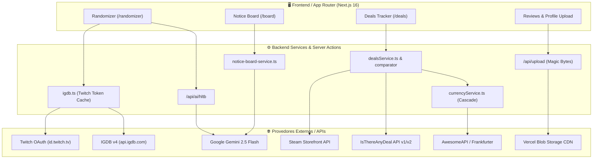

# 🔌 Manual de Integrações & APIs Externas

> **Documento de Arquitetura de Integrações & Serviços de Terceiros**  
> **Projeto:** Gamers Aposentados  
> **Versão:** 1.0  
> **Escopo:** Mapeamento técnico exaustivo de todas as APIs externas consumidas pelo sistema, fluxos de autenticação, caching, limites de taxa (rate limits), diagramas de sequência e estratégias de fallback/contingência.

---

## 📑 Índice de Integrações

1. [Visão Geral da Malha de Integrações](#1-visão-geral-da-malha-de-integrações)
2. [Matriz de Variáveis de Ambiente (.env)](#2-matriz-de-variáveis-de-ambiente-env)
3. [IGDB & Twitch OAuth (Catálogo & Metadados de Jogos)](#3-igdb--twitch-oauth-catálogo--metadados-de-jogos)
4. [Google Gemini 2.5 Flash & Search Grounding (IA de Campanha & HLTB)](#4-google-gemini-25-flash--search-grounding-ia-de-campanha--hltb)
5. [Steam Storefront API (Preços US & BR e Buscas)](#5-steam-storefront-api-preços-us--br-e-buscas)
6. [IsThereAnyDeal (ITAD) API (Histórico de Preços & Menor Preço)](#6-isthereanydeal-itad-api-histórico-de-preços--menor-preço)
7. [AwesomeAPI / Multi-Provider Câmbio (USD/BRL em Tempo Real)](#7-awesomeapi--multi-provider-câmbio-usdbrl-em-tempo-real)
8. [Vercel Blob Storage (Upload de Mídias & Screenshots)](#8-vercel-blob-storage-upload-de-mídias--screenshots)
9. [NextAuth v5 / Auth.js (Segurança & Sessões)](#9-nextauth-v5--authjs-segurança--sessões)

---

## 1. Visão Geral da Malha de Integrações



---

## 2. Matriz de Variáveis de Ambiente (.env)

| Variável | Provedor / Serviço | Finalidade | Obrigatório em Produção? |
| :--- | :--- | :--- | :---: |
| `DATABASE_URL` | PostgreSQL (Neon Cloud) | Conexão principal com pooling e SSL. | **Sim** |
| `AUTH_SECRET` | NextAuth v5 | Chave de assinatura para tokens JWT e cookies de sessão. | **Sim** |
| `NEXTAUTH_URL` | NextAuth v5 | URL canônica do app (`https://gamers-aposentados.vercel.app`). | **Sim** |
| `IGDB_CLIENT_ID` | Twitch Developers | ID da aplicação para emissão de App Access Token. | **Sim** |
| `IGDB_CLIENT_SECRET` | Twitch Developers | Segredo da aplicação para autenticação OAuth. | **Sim** |
| `GEMINI_API_KEY` | Google AI Studio | Chave para chamadas do Gemini 2.5 Flash + Search Grounding. | **Sim** |
| `ITAD_API_KEY` | IsThereAnyDeal | Consulta de preços históricos e ofertas em lojas autorizadas. | Opcional *(Degrada com fallback Steam)* |
| `BLOB_READ_WRITE_TOKEN` | Vercel Blob | Token de leitura e escrita para upload de imagens. | **Sim** |

---

## 3. IGDB & Twitch OAuth (Catálogo & Metadados de Jogos)

* **Código Fonte:** [`src/app/lib/igdb.ts`](file:///c:/Users/mathe/Desktop/gamers-aposentados/src/app/lib/igdb.ts) & [`src/lib/igdb-utils.ts`](file:///c:/Users/mathe/Desktop/gamers-aposentados/src/lib/igdb-utils.ts)
* **Objetivo:** Autocomplete de jogos no Randomizer, recuperação de capas verticais HD (`t_cover_big`), artes landscape para banners (`t_1080p` / `t_screenshot_big`) e resumos de enredo.

### 3.1 Fluxo de Autenticação OAuth (App Access Token)
1. O backend solicita um token de serviço via endpoint:
   `POST https://id.twitch.tv/oauth2/token?client_id={ID}&client_secret={SECRET}&grant_type=client_credentials`
2. **Estratégia de Cache:** O token emitido é encapsulado via `unstable_cache` do Next.js com a tag `igdb-twitch-token` e revalidação de **24 horas (86.400 segundos)**, eliminando chamadas repetidas à Twitch.

### 3.2 Consultas com Apicalypse & Sanitização
* **Endpoint:** `POST https://api.igdb.com/v4/games`
* **Headers:**
  ```http
  Client-ID: {IGDB_CLIENT_ID}
  Authorization: Bearer {TWITCH_TOKEN}
  Content-Type: text/plain
  ```
* **Payload de Busca (Apicalypse):**
  ```text
  search "{sanitizedQuery}"; 
  fields name, cover.image_id, category, game_type, parent_game, version_parent; 
  limit 50;
  ```
* **Regras Estritas de Filtragem em Memória:**
  Para evitar poluir as indicações do Randomizer com DLCs, expansões, trilhas sonoras ou bundles compostos, o backend aplica os seguintes predicados:
  * `category === 0` (Apenas jogos base; ignora remasters duplicados e pacotes).
  * `parent_game === undefined` e `version_parent === undefined` (Sem jogos pais).
  * `game_type !== 3` e `category !== 3` (Sem bundles).
  * `!name.includes(" + ")` (Filtro defensivo contra bundles mal etiquetados no IGDB).
* **Sanitização de Injeção:** A função `sanitizeApicalypseQuery` remove ou escapa aspas duplas (`"`), ponto-e-vírgulas (`;`) e quebras de linha para impedir adulteração de sintaxe no Apicalypse.

---

## 4. Google Gemini 2.5 Flash & Search Grounding (IA de Campanha & HLTB)

* **Código Fonte:** [`src/app/api/ai/hltb/route.ts`](file:///c:/Users/mathe/Desktop/gamers-aposentados/src/app/api/ai/hltb/route.ts) & [`src/services/notice-board-service.ts`](file:///c:/Users/mathe/Desktop/gamers-aposentados/src/services/notice-board-service.ts)
* **SDK:** `@google/genai` (Google Gen AI SDK v0.1.1) e chamadas REST nativas (`fetch`).
* **Modelo Utilizado:** `gemini-2.5-flash` (Otimizado para baixa latência e compatível com Google Search Grounding).

### 4.1 Caso de Uso 1: Extração Automatizada de HLTB (`/api/ai/hltb`)
* **Fluxo de Otimização de Tokens:**
  1. O endpoint recebe até 6 títulos de jogos.
  2. Executa uma busca prévia no PostgreSQL (`prisma.game.findMany`) procurando por jogos que já possuam `hltb_time` preenchido.
  3. **Zero Token Cost:** Se todos os jogos estiverem em cache local, retorna imediatamente sem acionar o Gemini.
  4. Para títulos inéditos, monta um prompt instruindo a IA a realizar pesquisa na web em tempo real através da ferramenta de busca (`tools: [{ googleSearch: {} }]`).
  5. As horas retornadas são arredondadas (ex: 5.5h $\to$ 6h, <1h $\to$ 1h) e gravadas em lote via transação Prisma (`prisma.$transaction`).
* **Mitigação de Rate Limit (429):** Se o Google retornar status HTTP 429 (exaustão de cota de RPM), o loop de requisições é abortado instantaneamente para não travar a thread.

### 4.2 Caso de Uso 2: Geração do Quadro de Avisos / Contratos (`notice-board-service.ts`)
* **Pipeline de Construção de Contexto:**
  1. Consulta enredo e sinopse no IGDB (`getGameContextIGDB`).
  2. Executa uma busca na web via Gemini com o prompt:  
     *"Pesquise a estrutura de campanha/modo carreira do jogo {title}. Liste em detalhes: capítulos, atos, fases, setlists e chefes reais..."*
  3. Combina o resumo do IGDB + Grounding do Gemini em um único contexto.
  4. Executa a geração com **JSON Schema estrito** (`responseSchema` do tipo `ARRAY` de objetos com `sequence_order`, `title`, `objective`, `progress_percentage`).
  5. Garante que o último contrato atinja exatamente **100%** de progresso.

---

## 5. Steam Storefront API (Preços US & BR e Buscas)

* **Código Fonte:** [`src/services/deals/steamStoreClient.ts`](file:///c:/Users/mathe/Desktop/gamers-aposentados/src/services/deals/steamStoreClient.ts)
* **Objetivo:** Rastrear preços oficiais da loja da Steam em BRL (Brasil) e USD (Estados Unidos) para cálculo do Comparador Steam Family.

### 5.1 Endpoints Consumidos

| Ação | Endpoint REST | Parâmetros Chave |
| :--- | :--- | :--- |
| **Busca de Jogos** | `GET https://store.steampowered.com/api/storesearch/` | `term={query}&l=english&cc=US` |
| **Preço Regional** | `GET https://store.steampowered.com/api/appdetails` | `appids={appId}&cc=us` ou `cc=br` |

### 5.2 Estratégia de Caching & Resiliência
* **Cache em Memória:** As buscas e preços são armazenados no `dealsCache` com TTL de **30 minutos** para buscas e **15 minutos** para detalhes de preço.
* **Spoofing de User-Agent:** Requisições incluem cabeçalho `User-Agent: Mozilla/5.0 (Windows NT 10.0; Win64; x64)` para evitar bloqueios intermitentes por WAF da Valve.
* **Tratamento de Jogos Gratuitos:** Se `is_free === true`, retorna preço formatado como `R$ 0,00` / `$0.00` com 100% de desconto.

---

## 6. IsThereAnyDeal (ITAD) API (Histórico de Preços & Menor Preço)

* **Código Fonte:** [`src/services/deals/itadClient.ts`](file:///c:/Users/mathe/Desktop/gamers-aposentados/src/services/deals/itadClient.ts)
* **Objetivo:** Identificar o Menor Preço Histórico (*All-Time Low*) e monitorar ofertas em lojas oficiais autorizadas (Steam, Nuuvem, Green Man Gaming, GOG, Humble Store, Epic Games, Fanatical).

### 6.1 Endpoints da API v1 / v2
* **Busca de Título:** `GET https://api.isthereanydeal.com/games/search/v1?key={KEY}&title={query}`
* **Visão Geral de Preços & All-Time Low:** `POST https://api.isthereanydeal.com/games/overview/v2?key={KEY}&country=US` (e `country=BR`).

### 6.2 Whitelist de Lojas Oficiais
Para evitar sites cinzentos (gray market) de revenda de chaves, o sistema mapeia apenas identificadores autorizados:
* `61` $\to$ Steam
* `84` $\to$ Nuuvem
* `29` $\to$ Green Man Gaming
* `37` $\to$ Humble Store
* `35` $\to$ GOG.com
* `16` $\to$ Epic Games Store
* `62` $\to$ Fanatical

---

## 7. AwesomeAPI / Multi-Provider Câmbio (USD/BRL em Tempo Real)

* **Código Fonte:** [`src/services/deals/currencyService.ts`](file:///c:/Users/mathe/Desktop/gamers-aposentados/src/services/deals/currencyService.ts)
* **Objetivo:** Obter a cotação comercial atualizada do Dólar Americano em relação ao Real Brasileiro para normalização monetária nas comparações de compra familiar.

### 7.1 Arquitetura de Cascata de Provedores (Failover Multi-Camadas)

```
  [ Requisição de Câmbio ]
              │
              ▼
  ┌────────────────────────┐      Sucesso (HTTP 200)
  │ Provedor 1: AwesomeAPI │ ──────────────────────────► Salva Cache (30 min)
  └───────────┬────────────┘
              │ Falha / Timeout
              ▼
  ┌────────────────────────┐      Sucesso (HTTP 200)
  │ Provedor 2: ExRate-API │ ──────────────────────────► Salva Cache (30 min)
  └───────────┬────────────┘
              │ Falha / Timeout
              ▼
  ┌────────────────────────┐      Sucesso (HTTP 200)
  │ Provedor 3: Frankfurter│ ──────────────────────────► Salva Cache (30 min)
  └───────────┬────────────┘
              │ Todas Falharam (Offline)
              ▼
  ┌────────────────────────┐
  │ Fallback Fixo: R$ 5.22 │ ──────────────────────────► Salva Cache Curto (5 min)
  └────────────────────────┘
```

1. **Provedor 1 (AwesomeAPI):** `https://economia.awesomeapi.com.br/last/USD-BRL` (Cotação comercial oficial brasileira com `bid`, `high`, `low` e `pctChange`).
2. **Provedor 2 (ExchangeRate-API):** `https://open.er-api.com/v6/latest/USD`.
3. **Provedor 3 (Frankfurter API):** `https://api.frankfurter.app/latest?from=USD&to=BRL`.
4. **Fallback de Emergência:** Se toda a rede externa falhar, adota o valor estático `5.22` com cache reduzido para 5 minutos, garantindo que o sistema nunca quebre em modo offline.

---

## 8. Vercel Blob Storage (Upload de Mídias & Screenshots)

* **Código Fonte:** [`src/app/api/upload/route.ts`](file:///c:/Users/mathe/Desktop/gamers-aposentados/src/app/api/upload/route.ts) & [`src/lib/file-validation.ts`](file:///c:/Users/mathe/Desktop/gamers-aposentados/src/lib/file-validation.ts)
* **SDK:** `@vercel/blob` (`put`)
* **Objetivo:** Armazenamento seguro de fotos de perfil (avatares) e capturas de tela anexadas em reviews de jogos.

### 8.1 Políticas e Validações de Segurança
* **Autenticação Obrigatória:** Apenas requisições com sessão ativa autenticada (`auth()`) são processadas.
* **Limite de Tamanho:** Máximo de **2 MB** por arquivo.
* **Validação de Magic Bytes:** Verificação binária do cabeçalho do buffer (assinatura JPEG, PNG, WEBP, GIF) para impedir uploads maliciosos disfarçados de imagem.
* **Whitelist Estrita de Pastas:** O parâmetro `folder` aceita unicamente: `["avatars", "screenshots", "covers"]`.
* **Nomenclatura Segura:** O arquivo é gravado no padrão `{folder}/{userId}-{timestamp}.{ext}` com sufixo aleatório gerado pela Vercel (`addRandomSuffix: true`), prevenindo colisões ou sobrescritas indevidas.

---

## 9. NextAuth v5 / Auth.js (Segurança & Sessões)

* **Código Fonte:** [`src/auth.ts`](file:///c:/Users/mathe/Desktop/gamers-aposentados/src/auth.ts) & [`src/auth.config.ts`](file:///c:/Users/mathe/Desktop/gamers-aposentados/src/auth.config.ts)
* **Estratégia:** Autenticação baseada em JWT com credenciais (`CredentialsProvider`), hash de senhas via `bcryptjs` e persistência no PostgreSQL via Prisma.
* **Endpoints Internos:**
  * `POST /api/auth/signin`
  * `POST /api/auth/signout`
  * `GET /api/auth/session`
* **Controle de Acesso RBAC:** O arquivo [`src/lib/randomizer-players.ts`](file:///c:/Users/mathe/Desktop/gamers-aposentados/src/lib/randomizer-players.ts) inspeciona o e-mail da sessão para conceder poderes administrativos no Randomizer exclusivamente aos jogadores oficiais da guilda.

---

## 10. Resumo de Resiliência & Códigos de Retorno

| Serviço | Timeout Configurado | Caching Padrão | Fallback em caso de Erro |
| :--- | :---: | :---: | :--- |
| **Twitch OAuth** | 10s | 24 Horas (`unstable_cache`) | Log de erro / Lança exceção controlada. |
| **IGDB Games** | 10s | Sem cache (Live) | Retorna array vazio `[]` sem derrubar a tela. |
| **Gemini (HLTB)** | 14s | Cache Permanente no Banco (DB) | Retorna `null` no tempo e não bloqueia o sorteio. |
| **Gemini (Notice Board)** | 20s | Gravado no PostgreSQL | Gera contratos estimativos baseados no HLTB. |
| **Steam Storefront** | 8s | 30 min (Search) / 15 min (Preço) | Retorna array vazio `[]`. |
| **ITAD Deals** | 10s | 30 min | Fallback automático para consulta direta na Steam. |
| **Câmbio USD/BRL** | 6s | 30 min (Live) / 5 min (Fallback) | Cascata de 3 provedores $\to$ Taxa fixa 5.22. |
| **Vercel Blob** | 15s | CDN Global Vercel | Retorna HTTP 500 com mensagem sanitizada. |
