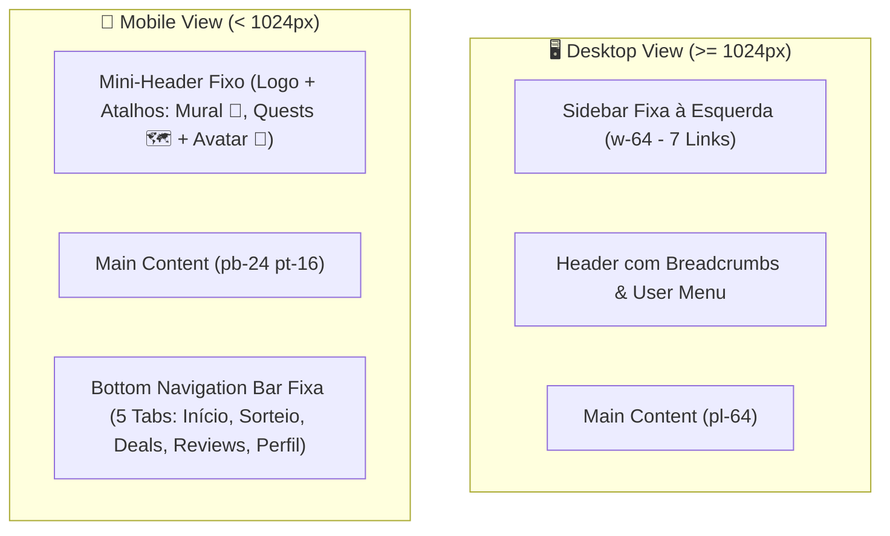

# 📱 Roteiro de Refatoração Mobile-First (Sem Regressão no Desktop)

> **Documento de Arquitetura de Interface, Responsividade & Design System Móvel**  
> **Projeto:** Gamers Aposentados  
> **Versão:** 1.0  
> **Estratégia:** Blindagem Total do Desktop + Experiência Nativa no Mobile (PWA)

---

## 📑 Índice do Roteiro

1. [Princípios de Blindagem do Desktop (Zero Regressão)](#1-princípios-de-blindagem-do-desktop-zero-regressão)
2. [Arquitetura de Navegação & Shell Global (Bottom Bar vs Sidebar)](#2-arquitetura-de-navegação--shell-global-bottom-bar-vs-sidebar)
3. [Revisão de Temas, Paletas & Design Tokens no Mobile](#3-revisão-de-temas-paletas--design-tokens-no-mobile)
4. [Banners de Perfil & Efeitos Especiais (BannerFxOverlay)](#4-banners-de-perfil--efeitos-especiais-bannerfxoverlay)
5. [Dashboard Central & Hub da Guilda](#5-dashboard-central--hub-da-guilda)
6. [The Great Randomizer (Sorteio & Potes)](#6-the-great-randomizer-sorteio--potes)
7. [Notice Board (Mural de Contratos com Touch Snap)](#7-notice-board-mural-de-contratos-com-touch-snap)
8. [Deals Tracker (Comparador Steam Family US vs BR)](#8-deals-tracker-comparador-steam-family-us-vs-br)
9. [Reviews, Hall of Fame & Armário de Recompensas](#9-reviews-hall-of-fame--armário-de-recompensas)
10. [Transformação em PWA (App Nativo Instalável)](#10-transformação-em-pwa-app-nativo-instalável)
11. [Matriz de Execução Passo a Passo (Fases 1 a 6)](#11-matriz-de-execução-passo-a-passo-fases-1-a-6)

---

## 1. Princípios de Blindagem do Desktop (Zero Regressão)

Para garantir que o desktop mantenha **100% da fidelidade visual atual**, todas as refatorações seguirão 4 regras estritas:

```
  ┌─────────────────────────────────────────────────────────────────────────┐
  │ 1. Prefixos de Breakpoint: md: e lg: preservam o Desktop original.     │
  │ 2. Classes base (sem prefixo): formatam exclusivamente o Mobile.        │
  │ 3. Component Swapping: 'hidden lg:flex' (PC) vs 'flex lg:hidden' (Cel). │
  │ 4. Teste Duplo Contínuo: 375px (iPhone) e 1920px (Desktop Full).        │
  └─────────────────────────────────────────────────────────────────────────┘
```

### Regras de Ouro Técnicas:
* **Nunca deletar classes desktop:** Se o desktop usa `grid-cols-12 gap-8 p-8`, ele se torna `flex flex-col gap-4 p-4 lg:grid lg:grid-cols-12 lg:gap-8 lg:p-8`.
* **Área de Toque Mínima (Apple HIG / Android Material):** Todo botão ou elemento interativo no mobile deve ter no mínimo **44x44px** de área clicável (`min-h-[44px] min-w-[44px]`).
* **Isolamento de Gestos:** Proibido o uso de `onMouseDown`/`onMouseMove` para emular scroll; adotar **CSS Scroll Snap Nativo**.

---

## 2. Arquitetura de Navegação & Shell Global (Bottom Bar vs Sidebar)

### 2.1 Diagnóstico Atual
* **Problema:** No mobile, o usuário precisa clicar em um menu hambúrguer no topo esquerdo, abrindo uma Sidebar lateral desenhada para monitores largos que esconde a tela inteira e dificulta o uso com uma só mão.

### 2.2 Nova Arquitetura Mobile (Shell Adaptativo)



### 2.3 Especificação da Bottom Navigation Bar (`BottomNav.tsx`)
A nova barra inferior flutuante/fixa conterá **5 destinos ergonômicos acessíveis pelo polegar**:

| Aba | Ícone Lucide | Rota | Descrição |
| :--- | :---: | :--- | :--- |
| **Início** | `Home` | `/` | Hub central com Quests Ativas, feed de eventos e Leaderboard. |
| **Sorteio** | `Dices` | `/randomizer` | Potes do Randomizer e Roleta de Sorteio. |
| **Deals** | `Tag` / `Scale` | `/deals` | Comparador de promoções Steam US vs BR e economia familiar. |
| **Reviews** | `History` / `Star` | `/reviews` | Feed de críticas, notas, galeria de screenshots e avaliações. |
| **Perfil** | `Trophy` / `User` | `/profile` | Hall da Fama, Recompensas, Títulos, Molduras e Temas. |

* **Acessos ao Mural de Contratos (`/board`):**
  * 📜 **Header Móvel (Topo):** Botão de atalho rápido com ícone de pergaminho neon ao lado do avatar.
  * ⚔️ **Card da Main Quest no Dashboard (`/`):** Botão de destaque principal `[ Abrir Mural de Contratos 📜 ]` logo abaixo da barra de progresso.
* **Outros Atalhos Rápidos no Header Móvel:**
  * 🗺️ **Histórico de Quests** (`/quests`): Acesso ao arquivo anual de campanhas.
  * ⚙️ **User Menu**: Configurações da conta, alteração de senha e Logout.
* **Estilo Visual:** Fundo escuro translúcido (`bg-zinc-950/90 backdrop-blur-lg border-t border-white/10`), com indicador ativo em Neon Glow (`text-theme-primary drop-shadow-[0_0_8px_var(--theme-glow)]`).
* **Suporte a Safe Areas (iOS):** Adição de `pb-[env(safe-area-inset-bottom,16px)]` para nunca sobrepor a barra de gestos do iPhone.

---

## 3. Revisão de Temas, Paletas & Design Tokens no Mobile

### 3.1 Otimização de Contrastes em Telas OLED Móveis
Telas de celular possuem brilhos e iluminações solares que exigem maior contraste de texto em relação a monitores de desktop:

| Tema | Cor Primária | Fundo Mobile Otimizado | Ajuste de Contraste Mobile |
| :--- | :--- | :--- | :--- |
| **Cyberpunk (Padrão)** | `#bd0df2` (Neon Purple) | `#09090b` (Deep Black) | Textos secundários em `text-zinc-300` (evitar cinzas apagados). |
| **Taverna Medieval** | `#f59e0b` (Âmbar Ouro) | `#0d0a07` (Couro Escuro) | Bordas douradas nítidas com `border-amber-500/50`. |
| **Odisseia Estelar** | `#38bdf8` (Ciano Espacial) | `#010410` (Vazio Cósmico) | Glows concentrados sem ofuscar botões de ação. |
| **Arcade Retrô** | `#22c55e` (Verde 16-Bit) | `#050716` (Fliperama) | Tipografia pixelada legível (`VT323` e `Press Start 2P` em tamanhos maiores). |
| **Fogueira de Lordran** | `#ea580c` (Brasa Viva) | `#070504` (Carvão) | Badges de status com fundos sólidos semitransparentes. |

### 3.2 Otimização de Performance de GPU (Backdrop Blur)
* **Desktop:** `backdrop-blur-xl` e sombras complexas são leves em placas de vídeo dedicadas.
* **Mobile:** Celulares intermediários engasgam com múltiplos blurs sobrepostos.  
  * *Solução:* No mobile usar `backdrop-blur-md` e limitar overlays animados simultâneos.

---

## 4. Banners de Perfil & Efeitos Especiais (BannerFxOverlay)

### 4.1 Diagnóstico do Problema
O componente `BannerFxOverlay` exibe efeitos de partículas (`animate-ping`, `animate-pulse`, scanlines e pétalas de sakura). No celular:
* A proporção ultra-wide do desktop (`aspect-[21/9]`) corta a imagem verticalmente ou comprime o texto do perfil.
* Partículas excessivas consom bateria e aumentam o aquecimento do dispositivo.

### 4.2 Solução Arquitetural
1. **Aspect Ratio Adaptativo:**
   * Desktop: `min-h-[340px]` com banner widescreen.
   * Mobile: `min-h-[260px]` com imagem centralizada e gradiente escuro inferior reforçado (`bg-gradient-to-t from-zinc-950 via-zinc-950/70 to-transparent`).
2. **Throttling de Partículas no Mobile:**
   * Esconder metade das partículas decorativas com `hidden sm:block`, mantendo apenas os efeitos principais (como as scanlines ou faíscas centrais).

---

## 5. Dashboard Central & Hub da Guilda

### 5.1 ActiveQuestHero (Card Principal da Main Quest)
* **Desktop Atual:** Card largo com banner ao fundo, informações à esquerda, barra de progresso central e botões de ação empilhados à direita.
* **Mobile Refatorado:**
  * **Bloco 1 (Topo):** Capa vertical em destaque com badge HLTB sobreposta + Título do Jogo em tamanho `text-2xl`.
  * **Bloco 2 (Meio):** Barra de progresso com porcentagem grande e texto do jogador responsável.
  * **Bloco 3 (Rodapé):** Grid 2x2 de Ações Rápidas com botões de toque largo:
    * `[ +10% Progresso ]` | `[ Concluir Quest 🏆 ]`
    * `[ Abrir Mural 📜 ]` | `[ Dropar Jogo 🛑 ]`

### 5.2 SideQuestBar (Side Quest Ativa)
* **Mobile:** Transformar a barra horizontal em um card compacto colapsável estilo "Mini-Player do Spotify", fixado logo abaixo do card principal.

### 5.3 StatsGrid & Leaderboard
* **StatsGrid (4 Estatísticas):**
  * Desktop: Linha única com 4 cards (`grid-cols-4`).
  * Mobile: Grid 2x2 compacto com números grandes (`text-2xl`) e ícones coloridos.
* **Leaderboard (Matheus vs Lucas):**
  * Desktop: Dois cards lado a lado (`grid-cols-2`).
  * Mobile: Card de Duelo unificado com barra comparativa de XP e avatares frente a frente (*Head-to-Head*).

---

## 6. The Great Randomizer (Sorteio & Potes)

### 6.1 Diagnóstico do Problema
A tela atual tenta mostrar as escolhas de Matheus e Lucas em colunas paralelas. No mobile, os cards ficam com menos de 150px de largura, cortando títulos e capas.

### 6.2 Solução com Abas Verticais (Tabs Pattern)
1. **Seletor de Abas no Topo:**
   * `[ Minhas Indicações (2/2) ]` | `[ Indicações do Lucas (1/2) ]`
2. **Cards de Jogos Verticais:**
   * Cada jogo ocupa a largura total da tela (`w-full`), exibindo capa nítida, título completo, botão de exclusão e badge HLTB.
3. **Modal de Busca IGDB:**
   * No mobile, o autocomplete abre em modo **Full Screen Overlay**, posicionando a barra de pesquisa fixa no topo com teclado virtual pronto para digitação sem cobrir os resultados.
4. **Botão de Sorteio Flutuante (Sticky Roll CTA):**
   * Quando o pote estiver completo (4/4 ou 6/6), o botão **"RODAR SORTEIO (ROLL)"** fixa-se na base da tela acima da Bottom Bar, emitindo um pulso neon.

---

## 7. Notice Board (Mural de Contratos com Touch Snap)

### 7.1 Diagnóstico do Problema
O mural utiliza uma função legada de arrasto com mouse (`useDragScroll`), que bloqueia o gesto natural de touch do celular e gera travamentos.

### 7.2 Solução com CSS Touch Snap Carousel
Substituir a lógica de mouse por **CSS Scroll Snap Nativo**:

```tsx
<div className="flex gap-4 overflow-x-auto snap-x snap-mandatory scrollbar-none px-4 py-2 touch-pan-x">
  {contracts.map(contract => (
    <div 
      key={contract.id}
      className="min-w-[85vw] max-w-[85vw] snap-center shrink-0 rounded-2xl border border-white/10 bg-zinc-950/90 p-5 shadow-xl"
    >
      {/* Conteúdo do Contrato do Capítulo */}
    </div>
  ))}
</div>
```
* **Comportamento Mobile:** O usuário desliza o dedo para a esquerda/direita e o card do próximo capítulo "encaixa" magneticamente no centro da tela.
* **Comportamento Desktop:** Permanece navegável com scroll horizontal ou trackpad sem interferência.

---

## 8. Deals Tracker (Comparador Steam Family US vs BR)

### 8.1 Diagnóstico do Problema
Os cards de comparação de preços colocam 3 colunas de dados (Preço EUA em Dólar, Preço Brasil em Real e Cálculo da Economia). Em telas de celular, os números ficam comprimidos e ilegíveis.

### 8.2 Solução em Card Empilhado Inteligente
* **Header do Card:** Capa do jogo + Selo da Loja Vencedora (ex: `🔥 Comprar na Steam Brasil: Economia de R$ 45,00`).
* **Corpo do Card:** Duas linhas limpas de comparação:
  * 🇧🇷 **Brasil (BRL):** R$ 120,00 (-50%)
  * 🇺🇸 **Estados Unidos (USD):** $29.99 $\to$ *Convertido: R$ 165,00*
* **Botão de Ação Direta:** Botão de largura total `[ Abrir Loja Oficial ]` com 48px de altura.

---

## 9. Reviews, Hall of Fame & Armário de Recompensas

### 9.1 Modais $\to$ Bottom Sheets (Gavetas Deslizantes)
* **Desktop:** Abrem no centro da tela em caixas de diálogo flutuantes.
* **Mobile:** Modais (`AddReviewModal`, `EditReviewModal`, `SettingsModal`) convertem-se em **Bottom Sheets** ancoradas na base da tela, com indicador visual de puxar (*drag handle*) e fechamento por gesto de arrastar para baixo.

### 9.2 Armário de Recompensas (Wardrobe)
* No celular, as abas de cosméticos viram **Pílulas Deslizáveis Horizontais**:
  `[ 🏷️ Títulos ]` `[ 🖼️ Molduras ]` `[ 🚩 Banners ]` `[ 🎨 Temas ]`
* A pré-visualização do avatar com moldura fica fixada no topo enquanto o catálogo desliza embaixo.

---

## 10. Transformação em PWA (App Nativo Instalável)

Adição de suporte oficial a PWA para permitir que o app seja adicionado à tela inicial do iPhone e Android com comportamento de aplicativo nativo.

### Arquivos Necessários:
1. `public/manifest.json`:
   ```json
   {
     "name": "Gamers Aposentados",
     "short_name": "Aposentados",
     "start_url": "/",
     "display": "standalone",
     "background_color": "#09090b",
     "theme_color": "#bd0df2",
     "icons": [
       { "src": "/icon.png", "sizes": "192x192", "type": "image/png" },
       { "src": "/icon.png", "sizes": "512x512", "type": "image/png" }
     ]
   }
   ```
2. Metatags no `src/app/layout.tsx`:
   * `apple-mobile-web-app-capable: "yes"`
   * `apple-mobile-web-app-status-bar-style: "black-translucent"`
   * `viewport: "width=device-width, initial-scale=1, maximum-scale=1, viewport-fit=cover"`

---

## 11. Matriz de Execução Passo a Passo (Fases 1 a 6)

```
┌──────────────────────────────────────────────────────────────────────────────┐
│ FASE 1: Shell, Layout & Bottom Navigation Bar                                │
│ └─ Criar BottomNav.tsx, ajustar layout.tsx e proteger Sidebar no Desktop.    │
├──────────────────────────────────────────────────────────────────────────────┤
│ FASE 2: Temas, Banners FX & Safe Areas                                       │
│ └─ Revisar BannerFxOverlay, contrastes OLED e suporte a safe-area-inset.     │
├──────────────────────────────────────────────────────────────────────────────┤
│ FASE 3: Dashboard Central (ActiveQuestHero & StatsGrid)                      │
│ └─ Empilhamento responsivo do card de quest ativa e métricas em 2x2.        │
├──────────────────────────────────────────────────────────────────────────────┤
│ FASE 4: Notice Board (Touch Snap Carousel)                                   │
│ └─ Eliminar mouse drag legado e implementar snap magnético touch.            │
├──────────────────────────────────────────────────────────────────────────────┤
│ FASE 5: The Great Randomizer & Deals Tracker                                 │
│ └─ Abas de indicações, sticky Roll CTA e cards comparativos empilhados.      │
├──────────────────────────────────────────────────────────────────────────────┤
│ FASE 6: Modais Bottom Sheet, Wardrobe & PWA Manifest                         │
│ └─ Transformação de modais em gavetas inferiores e manifest de instalação.   │
└──────────────────────────────────────────────────────────────────────────────┘
```
