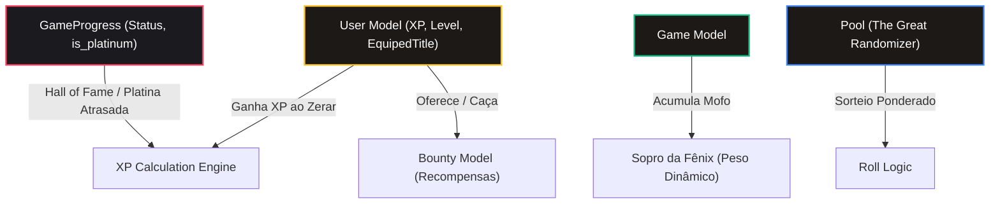

# 🎮 Proposta de Gamificação: Gamers Aposentados Edition

Este documento detalha a proposta estruturada para evoluir o sistema **Gamers Aposentados** com dinâmicas de RPG, mecânicas de risco/recompensa, Hall da Fama e sistema de XP e Níveis de Prestígio. Ele foi desenhado para se integrar perfeitamente ao esquema do Prisma e à arquitetura do projeto atual.

---

## 🏗️ Arquitetura de Dados de RPG

Abaixo está o mapeamento conceitual das relações de dados entre as entidades existentes (`User`, `Game`, `Pool`, `GameProgress`) e as novas mecânicas propostas:



---

## 1. Sistema Principal de XP e Níveis (Gamificação de Quests)

### 1.1. Princípios Fundamentais

1. **XP Puramente Estético & Prestígio**: O nível do jogador não concede vantagens injustas na Pool ou sorteios. Serve para demonstrar a jornada, liberar títulos e badges no perfil.
2. **Gatilho Exclusivo de Conclusão**: O XP é concedido **apenas quando o jogo é marcado como `COMPLETED` (Zerado)**. Não há distribuições de micro-XP por etapas parciais do quadro de avisos.
3. **Diferenciação por Categoria**:
   * **Main Quest**: O jogo de **Longo Prazo** (ex: *Titan Quest II*, RPGs/ARPGs) com duração de 3 a 4 meses.
   * **Side Quest**: Os jogos **Mensais** da Pool (ex: *Gauntlet*) com ciclo de renovação a cada mês.

---

### 1.2. Fórmula de Cálculo de XP

$$\text{XP Base} = \text{Horas HLTB} \times \text{Multiplicador de Categoria}$$

$$\text{XP Final} = (\text{XP Base} + \text{Bônus 100\%}) \times (1 + \text{Bônus Mofo})$$

| Categoria | Ciclo de Jogo | Multiplicador | Mínimo Garantido | Exemplo Real | XP Ganho |
| :--- | :--- | :---: | :---: | :--- | :---: |
| **Main Quest** | Longo Prazo *(3-4 meses)* | **$15\times$** | **300 XP** | **Titan Quest II** *(~40h HLTB)* | **600 XP** |
| **Side Quest** | Mensal *(1 mês)* | **$10\times$** | **50 XP** | **Gauntlet** *(~8h HLTB)* | **80 XP** |
| **Platinou / 100%** | Qualquer Jogo (na conclusão ou a posteriori no Hall of Fame) | **$+50\%$** | — | 100% no *Gauntlet* | **+40 XP Bônus** |
| **Resgate de Backlog (Mofo)** | Jogo com $\ge 3$ falhas em rolls | **$+20\%$** | — | Jogo antigo estagnado | **+20% no XP Total** |

---

### 1.3. Trilha Unificada de Recompensas por Nível (Rewards Catalog)

A progressão do **Gamers Aposentados** recompensa o jogador a cada nível alcançado. Em vez de títulos genéricos acumulados, cada nível concede itens cosméticos específicos (*Títulos*, *Bordas de Avatar PNG/CSS*, *Banners* e *Insígnias*), criando uma jornada visual inspirada em card games como *Gwent* e RPGs:

* **Fórmula do XP Necessário**: $XP_{\text{req}}(N) = \lfloor 100 \times N^{1.25} \rfloor$

#### 🎁 Tabela Oficial de Recompensas e Desbloqueios por Nível

| Nível | Item Desbloqueado | Tipo de Item | Raridade | Asset / Efeito Visual |
| :---: | :--- | :---: | :---: | :--- |
| **Nível 1** | **Aposentado Novato** (Título)<br>**Moldura de Madeira & Couro** (Borda) | Título<br>Borda | Comum | `wooden-frame.png`<br>Borda rústica de carvalho entalhado. |
| **Nível 2** | **Insígnia: Primeiro Passo** | Badge | Comum | Badge comemorativo no perfil. |
| **Nível 3** | **Limpador de Poeira** (Título) | Título | Comum | Título para quem desengavetou os primeiros jogos. |
| **Nível 4** | **Borda Bronze Forjado** (Borda) | Moldura | Incomum | `bronze-frame.png`<br>Moldura metálica de bronze com acabamento de armadura. |
| **Nível 5** | **Caçador de Backlog** (Título) | Título | Incomum | Título desbloqueado ao acumular vitórias iniciais. |
| **Nível 6** | **Banner Retro Arcade 16-Bit** | Banner | Incomum | Capa temática em pixel-art para o cabeçalho do perfil. |
| **Nível 7** | **Borda Prata da Guilda** (Borda) | Moldura | Raro | `silver-frame.png`<br>Moldura espelhada de prata polida. |
| **Nível 8** | **Destruidor de Pendências** (Título) | Título | Raro | Título de prestígio avançado. |
| **Nível 9** | **Borda Cyber Neon Cyan** (Borda) | Moldura | Raro | `cyber-neon-frame.png`<br>Borda energizada futurista com anel de plasma cyan. |
| **Nível 10** | **Veterano dos Controles** (Título) | Título | Épico | Título comemorativo de 10 níveis concluídos. |
| **Nível 12** | **Borda Ouro Entalhado** (Borda) | Moldura | Épico | `gold-frame.png`<br>Moldura áurea rica em detalhes góticos. |
| **Nível 14** | **Banner Mestre do Tempo Gamer** | Banner | Épico | Fundo estelar estilizado de galáxia e ampulheta quântica. |
| **Nível 16** | **Lenda do Retrogaming** (Título) | Título | Épico | Título honorário supremo. |
| **Nível 18** | **Borda Aura Violeta Celestial** (Borda) | Moldura | Épico | `celestial-violet-frame.png`<br>Moldura mística envolta em cristais e aura cósmica. |
| **Nível 20+** | **Mestre da Guilda Aposentada** (Título)<br>**Borda Fogo da Fênix** (Lendária) | Título<br>Moldura | Lendário | `legendary-frame.png`<br>Moldura suprema em chamas douradas e runas pulsantes. |

---

### 1.4. Arquitetura Técnica do Registro de Recompensas (`Reward Engine`)

1. **Mapeamento no Prisma (`prisma/schema.prisma`)**:
   Model `User` atualizada com suporte aos itens equipados:
   ```prisma
   model User {
     id             String   @id @default(uuid())
     xp_points      Int      @default(0)
     level          Int      @default(1)
     equipped_title  String?  // ex: "Caçador de Backlog"
     equipped_frame  String?  // ex: "/assets/frames/gold-frame.png"
     equipped_banner String?  // ex: "banner-retro-arcade"
   }
   ```

2. **Catálogo Declarativo em Código (`src/lib/constants/rewards.ts`)**:
   Todas as recompensas, caminhos de imagens em `public/assets/frames/` e classes de fallback CSS são gerenciadas no catálogo centralizado `REWARDS_CATALOG`.

3. **Detecção e Notificação Automática de Level Up**:
   Na Server Action de conclusão de jogo (`completeGameAction`):
   * Calcula o nível antigo (`oldLevel`) e o novo nível (`newLevel`).
   * Filtra em `REWARDS_CATALOG` os itens desbloqueados (`level > oldLevel && level <= newLevel`).
   * Retorna os novos itens para disparar o **Modal de Conquista & Level Up** com preview dos novos prêmios!

4. **Armário de Personalização no Perfil (`/profile`)**:
   Na página do perfil (`Hall of Fame`), o jogador acessa o armário com 3 abas:
   * **`[ 🎭 Títulos ]`**: Lista de títulos desbloqueados com seletor ativo.
   * **`[ 🛡️ Molduras de Avatar ]`**: Galeria de bordas PNG/CSS com preview do avatar em tempo real.
   * **`[ 🖼️ Banners de Perfil ]`**: Seletor de imagem de fundo para a capa do perfil.

---

## 2. Hall of Fame, Perfil & Pontos de Entrada no App (UI/UX)

### 2.1. Integração no App (PONTOS DE ACESSO)

Para que o acesso ao Perfil seja fluido e natural de qualquer lugar da aplicação:

1. **Item na Sidebar Navigation (`Hall of Fame`)**:
   * Adição do item oficial **`Hall of Fame`** na barra lateral principal (com ícone de Troféu 🏆), alinhado com *Dashboard*, *Notice Board* e *The Pool*.
2. **Clique na Imagem de Perfil / Avatar (Header & User Dropdown)**:
   * Clicar na **foto/avatar do usuário** (no cabeçalho superior ou no menu dropdown do usuário) direciona imediatamente para o **`Hall of Fame`** (`/profile`).
3. **Card de Resumo no Dashboard Main (`UserProfileWidget`)**:
   * No Dashboard principal, um Card estilizado exibe:
     * Avatar do Usuário com a borda do Rank atual.
     * **Nível Atual** + Barra de Progresso de XP animada.
     * **Título Equipado** (ex: *"Caçador de Backlog"*).
     * Mini estatísticas: Total de Jogos Zerados e Platinas.
     * Botão de ação proeminente: **`View Hall of Fame ➔`**.

---

### 2.2. A Experiência na Página de Perfil (`/profile`)

A página de perfil repaginada torna-se o hub central da carreira do gamer:

1. **Cabeçalho de Prestígio**:
   * Exibição ostensiva do Nível, XP acumulado e Título.
   * Modal de **Trocar/Equipar Título Desbloqueado**.
2. **Galeria do Hall of Fame (Trophy Room)**:
   * Todos os jogos zerados em formato de cards de colecionador.
   * **Botão de Platina Assíncrona ("🏆 Marcar Platina / 100%")** para jogos zerados que ainda não possuem 100%, permitindo adicionar o bônus de +50% de XP em qualquer momento futuro.
3. **Estatísticas Gerais**:
   * Gráfico/Métricas de horas jogadas (HLTB superado), histórico de conquistas e resgates de backlog.

---

### 2.3. Lógica de XP Retroativo (Backfill Migration)

Como o sistema já possui jogos completados no banco, implementaremos um script de migração/Server Action (`recalculateRetroactiveXP`):

1. **Varredura**: O script percorre todos os registros de `GameProgress` com `status = 'COMPLETED'`.
2. **Cálculo**:
   * Identifica se o jogo era `MAIN_QUEST` ou `SIDE_QUEST`.
   * Lê o `hltb_time` do modelo `Game`.
   * Verifica se `is_platinum` está ativado.
   * Aplica a fórmula oficial de XP.
3. **Atribuição**: Atualiza o `xp_points` do `User` e calcula o `level` correspondente automaticamente na primeira execução do novo sistema.

---

## 3. Resumo Comparativo dos Sistemas

| Sistema | Tipo de Mecânica | Principal Benefício | Esforço de Implementação |
| :--- | :--- | :--- | :--- |
| **XP & Níveis de Prestígio** | Progressão Principal | Sensação de conquista e recompensas retroativas | 🟢 Baixo (2-3 dias) |
| **Hall of Fame & Perfil** | Galeria & Platinas | Permite platinar jogos a qualquer momento assincronamente | 🟡 Médio (3-4 dias) |
| **Integração UI (Sidebar & Avatar)** | Navegação e Destaque | Torna a progressão acessível via Sidebar, Avatar ou Dashboard | 🟢 Baixo (1-2 dias) |
| **Sopro da Fênix** | Evolução de Sorteio | Evita frustração de jogos parados no backlog | 🟢 Baixo (1-2 dias) |
| **Bounty Board** | Desafios Pessoais | Incentiva a conclusão de jogos antigos | 🟡 Médio (3-4 dias) |

---

## 4. Plano de Implementação Sugerido (Faseado)

```
FASE 1: Modelo Prisma, Cálculo de XP & Script Retroativo
  ↳ Schema updates, cálculo de XP na Server Action e migração dos jogos já zerados.

FASE 2: Sidebar (Hall of Fame), Click no Avatar & Página /profile (Hall of Fame)
  ↳ Link na Sidebar, atalho no clique do Avatar, Widget no Dashboard, Galeria e botão de Platina Atrasada.

FASE 3: Sopro da Fênix (Sorteio Ponderado) & Quadro de Caça (Bounty Board)
  ↳ Peso dinâmico por mofo na Pool e mural de desafios.
```
